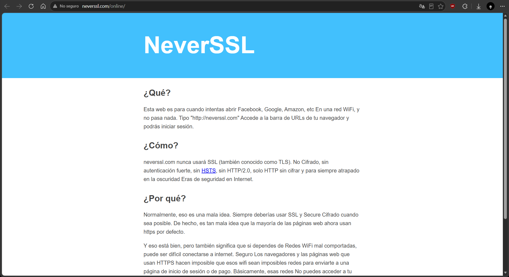
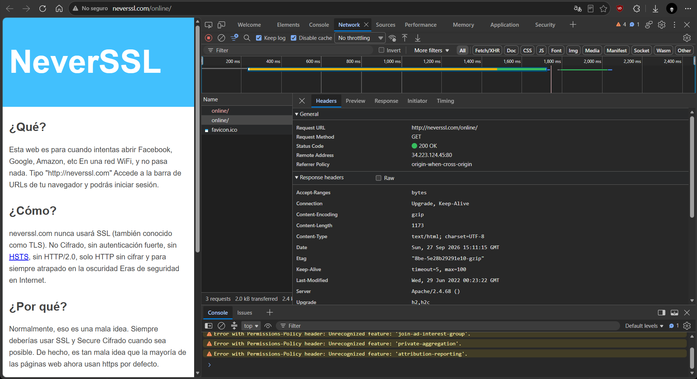
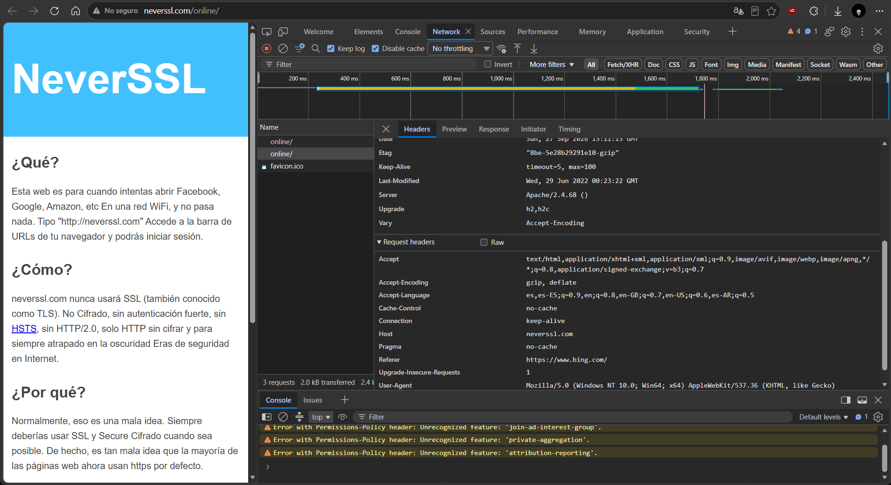

# Práctica Wi-Fi Segura

Trabajo práctico de Ciberseguridad - Seguridad en el aire: cómo sobrevivir a una Wi-Fi pública

Alumno: Federico Zangaro (federicozangaro@outlook.com)

## Introducción

En este trabajo analicé qué información se puede ver cuando uno entra a una página que usa HTTP. La idea es entender por qué es peligroso navegar así en una Wi-Fi pública, como la de un bar, un shopping o un aeropuerto, donde hay mucha gente conectada a la misma red.

Para hacerlo usé las herramientas de desarrollador del navegador (F12) y miré el tráfico en la pestaña Network.

## Sitio analizado

Sitio: http://neverssl.com

Host: neverssl.com

El sitio usa HTTP, no HTTPS. Se nota porque la dirección empieza con http://, el navegador muestra el cartel de "No seguro" en lugar del candado y la conexión va por el puerto 80, que es el de HTTP. Además, la misma página aclara que nunca usa SSL/TLS, o sea que no tiene cifrado.

La diferencia entre los dos es importante. HTTP es como mandar una postal escrita a mano: cualquiera que la agarre en el camino la puede leer. HTTPS es como mandar una caja fuerte cerrada con llave: aunque alguien la agarre, no puede ver lo que hay adentro.

Usé Microsoft Edge. Abrí F12, fui a la pestaña Network, recargué la página y elegí la primera solicitud. El sitio me redirigió a neverssl.com/online/, por eso aparece esa dirección en las capturas.

## Evidencia observada

Datos de la primera solicitud:

- URL: http://neverssl.com/online/
- Método: GET
- Host: neverssl.com
- Protocolo: HTTP (sin cifrar)
- Respuesta del servidor: 200 OK
- IP del servidor: 34.223.124.45, puerto 80

En los headers que envía el navegador se ven varias cosas sobre mí:

- Host: qué página estoy visitando.
- User-Agent: que uso Windows de 64 bits y Microsoft Edge versión 153.
- Accept-Language: que tengo el navegador en español, incluido español de Argentina.
- Referer: que llegué a la página desde Bing.

Todo esto viaja sin cifrar. Lo que yo veo en mi navegador lo podría ver cualquier persona conectada a la misma red usando un programa como Wireshark. Si la página tuviera un formulario para iniciar sesión o cookies, también se verían.

## Riesgos encontrados

Si navego por HTTP en una Wi-Fi pública, un atacante podría:

- Leer todo lo que envío y recibo capturando los paquetes con Wireshark. Esto se llama sniffing.
- Robar mi usuario y contraseña si los escribo en una página HTTP, o robar la cookie de sesión para entrar a mi cuenta.
- Hacerse pasar por el router (ataque Man-in-the-Middle). Así todo mi tráfico pasa por su computadora y hasta puede cambiar lo que veo, por ejemplo poniendo una descarga falsa.
- Crear una red falsa con un nombre parecido al del lugar, como "Starbucks_Gratis" (Evil Twin), para que me conecte y robarme los datos.
- Saber qué páginas visito, a qué hora, con qué navegador y desde dónde llegué.

Además, que la Wi-Fi tenga contraseña no quiere decir que sea segura. Si la clave está en el ticket del café, la tiene cualquiera que esté ahí.

Tampoco hace falta descargar algo para que me hackeen. Como se ve en este análisis, con solo navegar por un sitio inseguro ya quedan expuestos mis datos, mis hábitos y mis sesiones abiertas.

## Cómo ayuda una VPN

Una VPN crea un túnel seguro entre mi computadora y un servidor VPN. Todo lo que envío viaja por adentro de ese túnel.

La información se cifra antes de salir de mi computadora, así que si alguien la captura en la Wi-Fi solo ve ruido cifrado que no se puede leer. Esto funciona por encapsulamiento: cada paquete original, con el host, la URL y los headers, se mete dentro de otro paquete cifrado que va al servidor VPN. El atacante solo ve ese paquete de afuera.

De esta forma el tráfico queda protegido justo en la parte más peligrosa, que es la red pública, y tampoco pueden modificar lo que recibo sin que se note. También gano privacidad, porque las páginas ven la IP del servidor VPN y no la mía.

Sin VPN, el atacante puede ver la página que visito, la URL, los headers y el contenido. Con VPN solo puede ver que estoy conectado a una VPN.

Igual hay que tener en cuenta que desde el servidor VPN hasta neverssl.com la conexión sigue siendo HTTP. Por eso conviene usar una VPN confiable y, siempre que se pueda, entrar a páginas con HTTPS.

## 3 Reglas de Oro

1. No poner contraseñas ni datos personales en páginas que digan "No seguro" o que empiecen con http://.
2. Activar una VPN antes de navegar en una Wi-Fi pública. Para homebanking o pagos, mejor usar los datos del celular.
3. Preguntar en el lugar el nombre exacto de la red, no conectarse automáticamente a redes abiertas y olvidar la red al irse.
